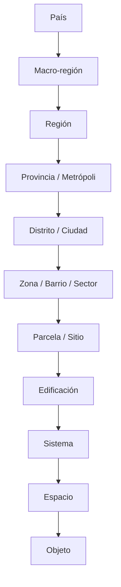
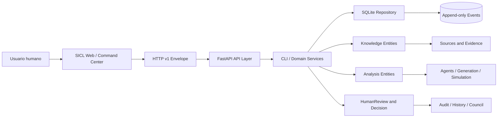

# SiMS-DeI 2.2 — Master Architecture

**Estado:** BASELINE DOCUMENTAL — DRAFT PARA FIRMA
**Sistema:** Sistema de Inteligencia de Diseño Espacial Multiescala (SiMS-DeI)
**Lenguaje formal:** SICL — Spatial Intelligence Command Language
**Versión arquitectónica:** 2.2
**Repositorio Core:** `YvanCastilloQuezada/sicl-core`
**Repositorio Web:** `YvanCastilloQuezada/sicl-web`
**Baseline Core:** `main@7aa37fd9ecc72ce88be87760678244744dfa43a2`
**Fecha:** 16 de septiembre de 2026
**Product Owner:** Usuario / arquitecto responsable
**Arquitecto/orquestador:** ChatGPT
**Implementador:** Manus AI

> Este documento sintetiza el estado arquitectónico, contractual, documental y operativo de SiMS-DeI 2.2. No sustituye el Core Contract, las RFC individuales ni la aprobación explícita del Product Owner.

## 1. Executive Summary

SiMS-DeI es un sistema de inteligencia de diseño espacial multiescala. Su propósito es organizar hechos, supuestos, preferencias, objetivos, restricciones, alternativas, evaluaciones, recomendaciones y decisiones humanas dentro de un flujo auditable.

SICL es el lenguaje formal que expresa comandos, entidades y operaciones del Core. SiMS-DeI es el sistema superior; SICL es su lenguaje formal y su contrato operativo.

La versión 2.2 consolida el modelo multiescala, el contrato HTTP canónico `/v1`, la evidencia y sus fuentes, simulaciones, análisis multiobjetivo, regulación, generación de diseño, memoria institucional, multi-actor, ciclos temporales, Monte Carlo, Source HTTP, evolución temporal de escenarios y políticas formales de versionado y RFCs.

La arquitectura conserva una frontera estricta entre observación y decisión. El sistema puede registrar y analizar información, pero una recomendación no es una decisión y un agente no adquiere autoridad humana.

El baseline 2.2 es reproducible desde el commit indicado, con la suite del Core pasando después de consolidar RFC-013.1, RFC-017 y RFC-018.

## 2. Identidad: SiMS-DeI y SICL

### 2.1 SiMS-DeI

SiMS-DeI modela el diseño espacial como un proceso de conocimiento situado en escalas, tiempos, actores, fuentes y decisiones.

El sistema no se limita a dibujar alternativas. Conserva por qué una afirmación fue registrada, quién la propuso, qué evidencia la respalda, qué supuestos permanecen abiertos y qué autoridad humana aprobó una decisión.

### 2.2 SICL

SICL proporciona una sintaxis de comandos y una superficie HTTP para operar el Core. La CLI es útil para exploración, pruebas y operación directa; HTTP es la superficie canónica para clientes integrados.

El Core es la fuente de verdad para las entidades contractuales. El frontend no debe inventar estados que el Core remoto no pueda representar.

### 2.3 Frontera de autoridad

SiMS-DeI puede generar una evaluación o una recomendación. Solo una autoridad humana explícita puede registrar una Decision cuando el contrato exige HumanReview, actor y authority.

## 3. Principios constitucionales B-001

Los principios B-001 son las reglas de gobierno que deben preservarse durante la evolución del sistema.

### B-001.1 Autoridad humana

Las decisiones requieren autoridad humana identificable. El sistema registra la decisión; no decide por el humano.

### B-001.2 Recommendation ≠ Decision

Una Recommendation es una salida analítica o deliberativa. Una Decision es un acto humano registrado con actor y authority. No se deben fusionar por conveniencia de interfaz.

### B-001.3 HumanReview ≠ Decision

HumanReview registra que una persona revisó un asunto. La revisión no equivale automáticamente a una decisión.

### B-001.4 Fact ≠ Assumption

Fact y Assumption son entidades distintas. Un dato observado, citado o capturado no se convierte automáticamente en supuesto; un supuesto estimado no se presenta como hecho.

### B-001.5 Provenance

Toda afirmación relevante debe conservar fuente, método, evidencia o explicación de su origen cuando el contrato lo exige.

### B-001.6 Append-only

Events, Evidence, Simulations, ciclos, ramas, evoluciones y otras entidades históricas no se actualizan ni eliminan destructivamente. Las correcciones crean nuevas versiones o eventos.

### B-001.7 No inferencia oculta

La ausencia de información no autoriza a inferir una regla normativa, una decisión, una fuente o una preferencia. Los estados `UNKNOWN`, `CONFLICTING` e `INSUFFICIENT` deben mantenerse visibles cuando corresponda.

### B-001.8 Reproducibilidad

Los métodos deterministas deben declarar inputs, versión y, cuando aplique, semilla o hash de ejecución.

### B-001.9 Trazabilidad temporal

Los ciclos y escenarios agregan proyecciones. Una evolución temporal no reescribe ciclos previos ni decisiones históricas.

### B-001.10 No autoridad de agentes

Los agentes generan evaluaciones con fuente `EXPERT_SYSTEM`. No registran Decisions ni sustituyen HumanReview.

## 4. Separación SC-005

SC-005 define la separación entre conocimiento, deliberación y autoridad.

### 4.1 Capa de conocimiento

Incluye Facts, Assumptions, Evidence, Sources, SiteObservations, Regulations, NormativeInterpretations y NormativeSnapshots.

Esta capa describe lo conocido, lo supuesto, lo observado o lo interpretado. No decide.

### 4.2 Capa de análisis

Incluye Objectives, Constraints, Alternatives, GeneratedAlternatives, Evaluations, Comparisons, Simulations, MultiobjectiveResults, DesignPrinciples y Recommendations.

Esta capa puede evaluar, comparar, generar y explicar. Sus resultados no sustituyen autoridad humana.

### 4.3 Capa de revisión

HumanReview registra una revisión explícita, con actor, autoridad, estado y explicación. Puede ser prerequisito de operaciones de autoridad.

### 4.4 Capa de decisión

Decision es el registro formal del acto humano. El Core valida las condiciones contractuales antes de persistirla.

### 4.5 Capa de memoria

InstitutionalMemory conserva conocimiento institucional derivado con alcance, evidencia, confianza y estado. La memoria no se transforma automáticamente en una decisión.

## 5. Mapa de 11 escalas

SiMS-DeI utiliza once escalas espaciales canónicas, desde lo territorial hasta el objeto.

| Orden | Escala | Pregunta guía |
|---|---|---|
| 1 | País | ¿Qué marco nacional condiciona el problema? |
| 2 | Macro-región | ¿Qué coordinación interregional interviene? |
| 3 | Región | ¿Qué sistemas regionales y climáticos intervienen? |
| 4 | Provincia / Metrópoli | ¿Qué coordinación supramunicipal existe? |
| 5 | Distrito / Ciudad | ¿Qué estructura urbana organiza la decisión? |
| 6 | Zona / Barrio / Sector | ¿Qué tejido local y actores están involucrados? |
| 7 | Parcela / Sitio | ¿Qué condiciones específicas del lugar se observan? |
| 8 | Edificación | ¿Qué configuración arquitectónica se evalúa? |
| 9 | Sistema | ¿Qué sistema técnico o funcional se integra? |
| 10 | Espacio | ¿Cómo se organiza la experiencia y operación? |
| 11 | Objeto | ¿Qué componente material o técnico se decide? |

Las relaciones entre escalas se registran mediante ScaleRelation. Una relación no implica que la escala superior decida automáticamente por la inferior.

## 6. Arquitectura general

### 6.1 Cliente

SICL Web presenta módulos operativos, navegación, dashboards, consola y reportes. En producción, el fallback local no debe ocultar la ausencia del Core remoto.

### 6.2 HTTP

FastAPI valida requests con Pydantic, aplica autenticación de servicio cuando está configurada y devuelve el envelope canónico.

### 6.3 Dominio

El dominio Python contiene entidades, enums, invariantes y servicios de generación, simulación, agentes, memoria, multiescala y temporalidad.

### 6.4 Persistencia

SQLite contiene tablas de estado y tablas append-only. Las operaciones de mutación escriben estado y evento en una transacción cuando el contrato lo exige.

### 6.5 Auditoría

History y Events permiten revisar el orden temporal de operaciones. La auditoría no se trata como una autorización nueva.

## 7. Catálogo completo de entidades

### 7.1 Project

Project es el agregado principal. Contiene identidad, stage, versión, scopes y colecciones relacionadas.

### 7.2 Stage

Stage representa el estado operativo del proyecto, incluyendo `DRAFT`, `ACTIVE`, `PRELIMINARY_DESIGN` y `CLOSED`.

### 7.3 Objective

Objective expresa un objetivo con key, dirección, valor, proyecto y versión.

### 7.4 Constraint

Constraint expresa una restricción. En el alcance base, las restricciones duras tienen `hard=true`.

### 7.5 Role

Role vincula una función del proyecto con un actor o persona identificable.

### 7.6 Fact

Fact registra una afirmación tratada como hecho dentro del proyecto, con source y versión.

### 7.7 Assumption

Assumption registra una hipótesis, estimación o premisa con basis y versión.

### 7.8 Evidence

Evidence conserva una declaración capturada, su tipo, hash, fecha, método y referencia a Source.

### 7.9 Source

Source identifica el origen de una Evidence. Puede ser oficial, secundario, proporcionado por usuario o desconocido.

### 7.10 Alternative

Alternative representa una alternativa operativa evaluable, con nombre, descripción, parámetros, estado y fuente.

### 7.11 GeneratedAlternative

GeneratedAlternative contiene candidatos producidos por un método de generación. No es automáticamente Alternative.

### 7.12 Evaluation

Evaluation registra el valor de una alternativa respecto de un objetivo, con unidad, confianza y fuente.

### 7.13 Comparison

Comparison relaciona alternativas, evaluaciones y trade-offs. No decide cuál debe elegirse.

### 7.14 Recommendation

Recommendation expresa una recomendación derivada de análisis. No es Decision.

### 7.15 HumanReview

HumanReview registra revisión humana explícita, actor, authority, estado y explicación.

### 7.16 Decision

Decision registra una decisión humana. Requiere los controles de autoridad definidos por el contrato.

### 7.17 SiteObservation

SiteObservation representa observaciones del sitio con ubicación, valores, fuente, estado, método y captura.

### 7.18 Simulation

Simulation registra una ejecución de simulación, método, inputs, outputs, estado, hash y timestamps.

### 7.19 DesignPrinciple

DesignPrinciple contiene principios de diseño aplicables a escalas y contextos declarados.

### 7.20 PlanningInstrument

PlanningInstrument representa un instrumento de planificación con jurisdicción, autoridad, alcance, estado y fuente.

### 7.21 Regulation

Regulation representa una norma identificada, su jurisdicción, autoridad, vigencia, fuente y estado.

### 7.22 NormativeInterpretation

NormativeInterpretation conserva una interpretación técnica con disclaimer legal, confianza y estado de revisión.

### 7.23 NormativeSnapshot

NormativeSnapshot congela un conjunto de regulaciones e interpretaciones a una fecha de corte.

### 7.24 ScaleRelation

ScaleRelation registra una relación entre proyectos o escalas, con tipo, actor creador y timestamp.

### 7.25 InstitutionalMemory

InstitutionalMemory conserva conocimiento institucional derivado, evidencia, decisiones referenciadas, confianza y estado.

### 7.26 Actor

Actor representa una persona o rol participante con autoridad, intereses, restricciones y estado.

### 7.27 ActorPosition

ActorPosition registra una postura de un actor sobre una Recommendation, Alternative, propuesta o generación.

### 7.28 TemporalCycle

TemporalCycle representa un horizonte 2030, 2040, 2050 o CUSTOM con supuestos, objetivos y actores.

### 7.29 ScenarioBranch

ScenarioBranch representa una rama de escenario, sus condiciones, objetivos y estado de selección.

### 7.30 ScenarioEvolution

ScenarioEvolution registra una transición propuesta entre ciclos para un escenario, con changes, triggers, estado y autoridad de aplicación.

### 7.31 Event

Event es el registro append-only de una mutación o hecho operativo, con id, timestamp, project_id, type, payload, actor y source.

## 8. Superficie HTTP /v1

La superficie canónica devuelve un envelope con `contract_version`, `status`, `code`, `message`, `project_id`, `observed_version` y `data`.

### 8.1 Proyectos y estado

- `POST /v1/projects`
- `GET /v1/projects/{project_id}`
- `GET /v1/projects/{project_id}/snapshot`
- `GET /v1/projects/{project_id}/history`
- `POST /v1/projects/{project_id}/commands`

### 8.2 Objectives, constraints y roles

- `POST /v1/projects/{project_id}/objectives`
- `GET /v1/projects/{project_id}/objectives`
- `POST /v1/projects/{project_id}/constraints`
- `GET /v1/projects/{project_id}/constraints`
- `POST /v1/projects/{project_id}/roles`
- `GET /v1/projects/{project_id}/roles`

### 8.3 Evidence y Sources

- `POST /v1/projects/{project_id}/sources`
- `GET /v1/projects/{project_id}/sources`
- `GET /v1/projects/{project_id}/sources/{source_id}`
- `POST /v1/projects/{project_id}/evidence`
- `GET /v1/projects/{project_id}/evidence`
- `GET /v1/projects/{project_id}/evidence/{evidence_id}`

### 8.4 Alternatives y evaluación

- `POST /v1/projects/{project_id}/alternatives`
- `GET /v1/projects/{project_id}/alternatives`
- `POST /v1/projects/{project_id}/evaluations`
- `GET /v1/projects/{project_id}/evaluations`
- `POST /v1/projects/{project_id}/comparisons`
- `GET /v1/projects/{project_id}/comparisons`
- `POST /v1/projects/{project_id}/recommendations`
- `GET /v1/projects/{project_id}/recommendations`

### 8.5 HumanReview y Decision

- `POST /v1/projects/{project_id}/human-reviews`
- `GET /v1/projects/{project_id}/human-reviews`
- `POST /v1/projects/{project_id}/decisions`
- `GET /v1/projects/{project_id}/decisions`

### 8.6 Actores y posiciones

- `POST /v1/projects/{project_id}/actors`
- `GET /v1/projects/{project_id}/actors`
- `GET /v1/projects/{project_id}/actors/{actor_id}`
- `POST /v1/projects/{project_id}/positions`
- `GET /v1/projects/{project_id}/positions`
- `GET /v1/projects/{project_id}/positions/{position_id}`

### 8.7 Temporalidad

- `POST /v1/projects/{project_id}/cycles`
- `GET /v1/projects/{project_id}/cycles`
- `GET /v1/projects/{project_id}/cycles/{cycle_id}`
- `POST /v1/projects/{project_id}/scenarios`
- `GET /v1/projects/{project_id}/scenarios`
- `POST /v1/projects/{project_id}/scenarios/{branch_id}/select`
- `POST /v1/projects/{project_id}/scenario-evolutions`
- `GET /v1/projects/{project_id}/scenario-evolutions`
- `GET /v1/projects/{project_id}/scenario-evolutions/{evolution_id}`
- `POST /v1/scenario-evolutions/{evolution_id}/apply`

### 8.8 Simulación y multiobjetivo

- `POST /v1/projects/{project_id}/simulations`
- `GET /v1/projects/{project_id}/simulations`
- `GET /v1/simulations/methods`
- `POST /v1/projects/{project_id}/multiobjective`
- `GET /v1/projects/{project_id}/multiobjective`
- `POST /v1/projects/{project_id}/pareto`

### 8.9 Generación, memoria y escalas

- `POST /v1/projects/{project_id}/generations`
- `GET /v1/projects/{project_id}/generations`
- `GET /v1/generations/methods`
- `POST /v1/projects/{project_id}/generations/{generation_id}/promote`
- `GET /v1/projects/{project_id}/memory`
- `POST /v1/projects/{project_id}/memory/extract`
- `POST /v1/projects/{project_id}/memory/{memory_id}/apply`
- `POST /v1/projects/{project_id}/scale-relations`
- `GET /v1/projects/{project_id}/scale-relations`

### 8.10 Regulación y planificación

- `POST /v1/projects/{project_id}/planning-instruments`
- `GET /v1/projects/{project_id}/planning-instruments`
- `POST /v1/regulations`
- `GET /v1/regulations`
- `POST /v1/interpretations`
- `GET /v1/interpretations`
- `POST /v1/normative-snapshots`
- `GET /v1/normative-snapshots`

## 9. Comandos CLI completos

### 9.1 Proyecto y flujo base

- `/PROJECT CREATE <project_id> <name>`
- `/PROJECT OPEN <project_id>`
- `/PROJECT SHOW`
- `/PROJECT LIST`
- `/PROJECT SET SCOPE <scope>`
- `/STAGE SET <stage>`
- `/STATUS`
- `/HISTORY`
- `/EXIT`

### 9.2 Conocimiento

- `/FACT SET <statement> [source]`
- `/ASSUMPTION SET <statement> [basis]`
- `/EVIDENCE ADD ...`
- `/EVIDENCE LIST`
- `/EVIDENCE SHOW <evidence_id>`
- `/SOURCE ADD <source_id> <source_type> <title> [url]`
- `/SOURCE LIST`
- `/SOURCE SHOW <source_id>`
- `/SITE INTELLIGENCE <location>`

### 9.3 Objetivos y restricciones

- `/OBJECTIVE SET <key> <direction> <value>`
- `/OBJECTIVE IMPORT <project_id> <objective_id>`
- `/CONSTRAINT SET <key> <operator> <value> [unit]`
- `/ROLE ADD <role_id> <name> <actor>`

### 9.4 Alternativas y análisis

- `/ALTERNATIVE CREATE <id> <name> <description> [parameters_json]`
- `/ALTERNATIVE PROMOTE <generation_id> <candidate_index> <actor> <authority>`
- `/EVALUATE <alternative> <objective> <value> [unit] [confidence] [source]`
- `/COMPARE <alternative_ids>`
- `/RECOMMEND <statement> ...`
- `/DECISION RECORD <statement> <actor> <authority>`
- `/HUMAN REVIEW <actor> <timestamp> <statement> <authority>`

### 9.5 Agentes y generación

- `/AGENT RUN BIOCLIMATIC <alternative_id>`
- `/AGENT RUN STRUCTURAL <alternative_id>`
- `/AGENT RUN ECONOMIC <alternative_id>`
- `/DEBATE <alternative_id>`
- `/GENERATE <method> <inputs>`
- `/GENERATE DESIGN <method> <inputs>`
- `/GENERATE LIST`
- `/GENERATE SHOW <generation_id>`
- `/GENERATE METHODS`

### 9.6 Simulación y Pareto

- `/SIMULATE DETERMINISTIC <inputs>`
- `/SIMULATE SENSITIVITY <inputs>`
- `/SIMULATE MONTE_CARLO <inputs>`
- `/SIMULATION METHODS`
- `/PARETO <objective_a> <objective_b>`
- `/TRADEOFF_MATRIX <objective_a> <objective_b>`
- `/MULTIOBJECTIVE <objectives>`

### 9.7 Actores, temporalidad y memoria

- `/ACTOR ADD <id> <role> <name> <authority>`
- `/ACTOR LIST`
- `/ACTOR SHOW <id>`
- `/POSITION ADD <actor> <subject_type> <subject_id> <stance> <reason>`
- `/POSITION LIST`
- `/CYCLE CREATE <id> <horizon> <start_date>`
- `/CYCLE LIST`
- `/CYCLE SHOW <id>`
- `/SCENARIO CREATE <id> <cycle_id> <name>`
- `/SCENARIO LIST`
- `/SCENARIO SELECT <id> <actor> <authority>`
- `/EVOLUTION CREATE <id> <scenario> <from_cycle> <to_cycle>`
- `/EVOLUTION ADD CHANGE <id> <key> <value>`
- `/EVOLUTION ADD TRIGGER <id> <trigger>`
- `/EVOLUTION APPLY <id> <actor> <authority>`
- `/EVOLUTION LIST`
- `/EVOLUTION SHOW <id>`
- `/MEMORY LIST`
- `/MEMORY SHOW <id>`
- `/MEMORY EXTRACT <project_id> <actor> <authority>`
- `/MEMORY APPLY <id> <actor>`
- `/MEMORY REVOKE <id> <actor> <authority>`

### 9.8 Escalas, planificación y regulación

- `/SCALE PARENT <scope>`
- `/SCALE CHILDREN <scope>`
- `/SCALE RELATE <parent> <child> <type>`
- `/SCALE RELATIONS`
- `/PLANNING ADD ...`
- `/PLANNING LIST`
- `/PLANNING SHOW <id>`
- `/REGULATION ADD ...`
- `/REGULATION LIST`
- `/REGULATION SHOW <id>`
- `/REGULATION STATUS <id>`
- `/INTERPRET ADD ...`
- `/INTERPRET LIST`
- `/INTERPRET REVIEW <id> ...`
- `/SNAPSHOT CREATE ...`
- `/SNAPSHOT LIST`
- `/SNAPSHOT FREEZE <id>`

## 10. Invariantes del sistema

1. `Recommendation != Decision`.
2. `HumanReview != Decision`.
3. Decision requiere actor y authority cuando el contrato lo establece.
4. Fact no es Assumption.
5. Evidence no se convierte automáticamente en Fact.
6. Source conserva procedencia.
7. Events son append-only.
8. Evidence es inmutable.
9. Simulation conserva inputs, outputs y hash.
10. Project cerrado no acepta mutaciones incompatibles.
11. Constraint MVP es HARD.
12. Los agentes solo generan Evaluation.
13. Los agentes no toman decisiones.
14. La generación produce candidatos, no Alternatives aprobadas automáticamente.
15. La promoción exige autoridad humana.
16. Las comparaciones describen trade-offs y no deciden.
17. Las ramas temporales no sobrescriben otras ramas.
18. La selección de escenario requiere revisión humana según el contrato.
19. ScenarioEvolution no reescribe ciclos previos.
20. Aplicar ScenarioEvolution requiere actor y authority.
21. ScenarioEvolution no crea Recommendation ni Decision.
22. Regulatory Intelligence lleva disclaimer técnico y no certificación legal.
23. Interpretaciones normativas conservan fuente y estado de verificación.
24. Estados `UNKNOWN`, `CONFLICTING` e `INSUFFICIENT` no deben colapsarse.
25. La ausencia de un dato no autoriza inferencia oculta.
26. La memoria institucional conserva evidencia y confianza.
27. Los actores no adquieren autoridad por el solo hecho de existir.
28. Las posiciones no sustituyen HumanReview.
29. Los scopes multiescala deben declararse.
30. Las relaciones de escala son append-only.
31. El frontend no debe presentar fallback local silencioso como PASS remoto.
32. El versionado contractual sigue MAJOR.MINOR.PATCH.
33. Los cambios de contrato requieren RFC.
34. Una RFC no aprobada no autoriza implementación.
35. Un tag identifica el commit real de release.

## 11. Decisiones registradas

### PO-001 — Alcance del E2E mínimo

Camino A primero: Project → Preference → Recommendation → HumanReview → Decision → Audit → Council. Camino B queda para una fase posterior con Evidence, Objective, Constraint, Alternative, Evaluation y Comparison.

### PO-002 — Aprobación formal de SiMS-DeI

SiMS-DeI se aprueba como sistema superior; SICL permanece como lenguaje formal. La decisión no autoriza modificar líneas congeladas ni saltar contratos.

### PO-003 — Regulatory Intelligence

Se asume responsabilidad técnica y se exige disclaimer visible. No constituye certificación legal ni reemplaza revisión profesional.

### PO-004 — Rotación de credencial

La revocación del token histórico fue aceptada como riesgo residual. La política futura exige credenciales fine-grained con expiración limitada.

### PO-005 — Visibilidad de sicl-core

El Core permanece público hasta el cierre de SICL 1.0; después se reevalúa la conversión a privado.

### PO-006 — Simulador Fase A

El simulador antiguo se marca NO ATABLE — DEPRECATED. Su reconstrucción pertenece a RFC-006.

### PO-007 — Dirección canónica

`sicl-core` HEAD v2 es la base canónica de SiMS-DeI con reparaciones constitucionales: Site Intelligence sin inferencia normativa, HumanReview previo a Decision, trazabilidad de SiteObservation y estados generales.

### PO-008 — Contrato HTTP

La superficie canónica es `/v1/...` con envelope estable y separación entre cliente Web y Core remoto.

### PO-009 — Persistencia

SQLite permanece como adaptador aprobado con tablas de estado y eventos append-only.

### PO-010 — Publicación

Los releases deben conservar tags, commits, tests y documentación identificables.

### PO-011 — Credenciales futuras

Solo se aceptan tokens fine-grained con expiración máxima de 90 días y rotación documentada.

### CO-001 — Frontend funcional

La prioridad del frontend es funcionalidad y operación de entidades, no embellecimiento definitivo.

### CO-002 — Líneas de frontend

SICL 0.6 se conserva como línea histórica; frontend v2 se desarrolla como interfaz funcional de las capacidades nuevas.

### CO-003 — Frontend v2

El frontend v2 debe operar las entidades del Core de forma simple y verificable. El frontend definitivo queda para una etapa posterior.

### CO-004 — Fuente remota de verdad

Cuando el Core remoto es obligatorio, producción debe fallar cerrado y no usar fallback local silencioso.

## 12. Estado por capacidad

| Capacidad | Estado | Referencia |
|---|---|---|
| Modelo multiescala | IMPLEMENTED | RFC-001 |
| HTTP canónico `/v1` | IMPLEMENTED | RFC-002 |
| Evidence HTTP | IMPLEMENTED | RFC-002 extension |
| Regulatory Corpus | IMPLEMENTED / limitado | RFC-003 |
| Design Intelligence | IMPLEMENTED | RFC-004 |
| Evaluation / Comparison HTTP | IMPLEMENTED | RFC-005 |
| Simulation Contract | IMPLEMENTED | RFC-006 |
| Monte Carlo | IMPLEMENTED | RFC-006.1 |
| Multiobjective / Pareto | IMPLEMENTED | RFC-007 |
| Planning Instruments | IMPLEMENTED | RFC-008 |
| Multiscale Relations | IMPLEMENTED | RFC-009 |
| Design Generation | IMPLEMENTED | RFC-010 |
| Generation Extended | IMPLEMENTED / LLM no configurado | RFC-016.1 |
| Institutional Memory | IMPLEMENTED | RFC-011 |
| Multi-Actor Model | IMPLEMENTED | RFC-012 |
| Temporal Cycles | IMPLEMENTED | RFC-013 |
| Temporal Evolution | IMPLEMENTED | RFC-013.1 |
| User Copilot | DOCUMENTED / integración controlada | RFC-014 |
| Frontend v2 | DOCUMENTED / funcional | RFC-015 |
| Source HTTP | IMPLEMENTED | RFC-016 |
| Contract Versioning Policy | DOCUMENTED | RFC-017 |
| RFC Process | DOCUMENTED | RFC-018 |

## 13. Tags y versiones

Los tags son referencias históricas; no deben moverse después de ser publicados.

- `sicl-2.0-constitutional-repair`: baseline de reparaciones constitucionales.
- `sicl-2.0-multiscale-complete`: consolidación multiescala RFC-001 a RFC-009.
- `sicl-2.1-docs`: documentación de User Copilot, User Manual y Glossary.
- `sicl-2.1-multi-actor-temporal`: RFC-010 a RFC-013 consolidados.
- `sicl-2.2`: baseline con Monte Carlo, Source HTTP y extensiones de generación.
- `sicl-2.2-final`: tag previsto para la consolidación completa de este documento.

## 14. RFCs completos y extensiones

| RFC | Tema | Estado |
|---|---|---|
| RFC-001 | Multiscale Model | IMPLEMENTED |
| RFC-002 | Canonical HTTP v1 | IMPLEMENTED |
| RFC-002 extension | Evidence HTTP | IMPLEMENTED |
| RFC-003 | Regulatory Corpus | IMPLEMENTED / limitado |
| RFC-004 | Design Intelligence | IMPLEMENTED |
| RFC-005 | Evaluation / Comparison HTTP | IMPLEMENTED |
| RFC-006 | Simulation Contract | IMPLEMENTED |
| RFC-006.1 | Monte Carlo v1 | IMPLEMENTED |
| RFC-007 | Multiobjective / Pareto | IMPLEMENTED |
| RFC-008 | Planning Instruments | IMPLEMENTED |
| RFC-009 | Multiscale Relations | IMPLEMENTED |
| RFC-010 | Design Generation | IMPLEMENTED |
| RFC-011 | Institutional Memory | IMPLEMENTED |
| RFC-012 | Multi-Actor Model | IMPLEMENTED |
| RFC-013 | Temporal Cycles | IMPLEMENTED |
| RFC-013.1 | Temporal Evolution | IMPLEMENTED |
| RFC-014 | User Copilot | DOCUMENTED |
| RFC-015 | Frontend v2 | DOCUMENTED |
| RFC-016 | Source HTTP | IMPLEMENTED |
| RFC-016.1 | Design Generation Extended | IMPLEMENTED |
| RFC-017 | Core Contract Versioning Policy | DOCUMENTED |
| RFC-018 | RFC Process | DOCUMENTED |

Cada RFC conserva su propia motivación, alcance, tests y limitaciones. Este documento no reemplaza esos detalles.

## 15. Documentos auxiliares

- `docs/SICL_CORE_CONTRACT_v1.0.md`: contrato normativo del Core.
- `docs/USER_MANUAL.md`: manual operativo actualizado para 2.2.
- `docs/GLOSSARY.md`: vocabulario común de SICL y SiMS-DeI.
- `docs/RFC-006_SIMULATION_CONTRACT.md`: contrato de simulación.
- `docs/RFC-006.1_MONTE_CARLO.md`: Monte Carlo reproducible.
- `docs/RFC-013_TEMPORAL_CYCLES.md`: ciclos, escenarios y evolución.
- `docs/RFC-017_CORE_CONTRACT_VERSIONING.md`: política de versionado.
- `docs/RFC-018_RFC_PROCESS.md`: proceso de RFCs.
- `docs/SIMS_DEI_MASTER_ARCHITECTURE_v2.md`: antecedente de arquitectura maestra.
- `DEMO_SCRIPT_V2.md`: guion de demostración cuando está disponible en el baseline.

Los documentos auxiliares deben declarar si son normativos, operativos, históricos o experimentales.

## 16. Frontend v1 — sicl-web@main

SICL Web proporciona el Command Center funcional con navegación, dashboard, consola, módulos de proyecto, contexto, objetivos, alternativas, council, decision, audit y governance.

La línea v1 conserva la UX histórica y se integra gradualmente con el cliente HTTP. Sus componentes no deben inventar capacidades fuera del contrato consumido.

La configuración de producción debe usar `VITE_API_URL` o la configuración equivalente definida por el proyecto. El token del Core, cuando exista, debe permanecer server-side.

El modo de desarrollo puede tener fallback explícito si está documentado. Producción debe distinguir claramente fallback local de operación contra Core remoto.

## 17. Frontend v2 funcional

RFC-015 define un frontend v2 funcional y simple. Su prioridad es operar entidades, no alcanzar la estética definitiva.

El frontend v2 consume el Core v2 mediante contratos HTTP tipados, conserva la gestión de estado y muestra estados de carga, error, revisión y autoridad.

La interfaz debe mostrar la diferencia entre Recommendation, HumanReview y Decision. Un botón de recomendación no puede parecer un botón de decisión final sin una etapa explícita de revisión.

La navegación activa y las preferencias de tema son capacidades de presentación; no amplían la semántica del Core.

## 18. User Copilot — RFC-014

User Copilot es una interfaz asistiva para ayudar a explorar comandos, entidades, contexto y explicaciones.

El Copilot no tiene autoridad decisional. Sus salidas deben tratarse como propuesta, explicación o ayuda de usuario y no como Fact, Evidence, Recommendation o Decision sin una operación explícita y validada.

Las capacidades LLM deben declarar modelo, configuración, límites, procedencia y estado. `llm_assisted_v1` permanece `DEFINED_NOT_CONFIGURED` cuando no existe un proveedor autorizado.

El Copilot debe evitar afirmar que una inferencia es un hecho. Cuando falta información, debe pedirla o expresar un estado insuficiente.

## 19. Bloqueos abiertos

### 19.1 Estado del baseline

No se declara un bloqueo técnico crítico en la suite verificada del Core posterior a la consolidación de RFC-013.1, RFC-017 y RFC-018.

### 19.2 Bloqueos de gobernanza

La firma formal de este documento maestro y la aprobación de RFC-017 y RFC-018 como políticas vigentes siguen siendo decisiones del Product Owner.

### 19.3 Bloqueos de despliegue

La disponibilidad de un Core remoto con HTTPS, token, persistencia y restart test debe verificarse por separado. Este documento no declara E2E remoto sin evidencia.

### 19.4 Bloqueos funcionales

Regulatory Intelligence requiere mantener disclaimer y revisión profesional externa cuando el Product Owner lo considere necesario. No debe presentarse como certificación legal.

### 19.5 Bloqueos LLM

El método LLM-assisted no debe declararse operativo hasta configurar un proveedor autorizado y ejecutar sus pruebas de seguridad, reproducibilidad y trazabilidad.

## 20. Roadmap pendiente

1. Crear y publicar el tag `sicl-2.2-final` después de consolidar el documento maestro.
2. Completar E2E Camino A contra Core remoto real.
3. Verificar HTTPS, token, persistencia y restart test.
4. Integrar frontend v2 con todas las rutas necesarias, sin consumo artificial.
5. Completar RFC-002 y RFC-005 donde existan limitaciones declaradas.
6. Definir RFC-003 operativo con corpus y disclaimers.
7. Configurar de forma autorizada `llm_assisted_v1`.
8. Crear pruebas de compatibilidad de RFC-017.
9. Aplicar el proceso de RFC-018 a futuras ampliaciones.
10. Diseñar exportaciones de auditoría y reportes como proyecciones versionadas.
11. Evaluar migración de SQLite para despliegues con volumen persistente.
12. Revaluar visibilidad pública antes de SICL 1.0 final.
13. Preparar revisión independiente de invariantes constitucionales.
14. Documentar un procedimiento formal de recuperación de backups.
15. Preparar release comercial sin modificar la autoridad humana.

## 21. Histórico

### SICL 0.6

Línea web operacional con UX, copilotos, sliders, dashboard, reportes y lógica histórica. Se mantiene como referencia de compatibilidad y no debe modificarse sin alcance explícito.

### SICL 1.0

Línea Core orientada a ontología primero, CLI, SQLite, entidades básicas y eventos append-only. Estableció la separación Fact/Assumption y la autoridad de Decision.

### SiMS-DeI 2.0

Introdujo el modelo multiescala, HTTP v1, Evidence, Evaluation, Comparison, simulación, Pareto, planificación, relaciones de escala y regulación.

### SiMS-DeI 2.1

Añadió generación, memoria institucional, multi-actor y ciclos temporales. Se consolidó la lectura temporal y multi-actor del diseño.

### SiMS-DeI 2.2

Añadió Monte Carlo, Source HTTP, generación extendida, evolución temporal, política de versionado del contrato y proceso formal de RFCs.

El histórico demuestra una evolución por capas. Cada capa debe conservar las invariantes constitucionales, incluso cuando el número de entidades y endpoints aumente.

## 22. Referencias

- [SICL Core Contract v1.0](SICL_CORE_CONTRACT_v1.0.md)
- [SiMS-DeI Master Architecture v2](SIMS_DEI_MASTER_ARCHITECTURE_v2.md)
- [User Manual](USER_MANUAL.md)
- [Glossary](GLOSSARY.md)
- [RFC-013 Temporal Cycles](RFC-013_TEMPORAL_CYCLES.md)
- [RFC-017 Core Contract Versioning Policy](RFC-017_CORE_CONTRACT_VERSIONING.md)
- [RFC-018 RFC Process](RFC-018_RFC_PROCESS.md)
- [Repositorio sicl-core](https://github.com/YvanCastilloQuezada/sicl-core)
- [Repositorio sicl-web](https://github.com/YvanCastilloQuezada/sicl-web)

Las referencias internas deben apuntar a documentos versionados. Las referencias externas no sustituyen fuentes de evidencia del dominio.

## 23. Firma del baseline

Este documento representa el estado documental propuesto para SiMS-DeI 2.2 en el commit indicado. La firma no transfiere autoridad de decisión al sistema ni a sus agentes.

**Product Owner:** pendiente de firma formal.

**Arquitecto/orquestador:** ChatGPT.

**Implementador:** Manus AI.

**Revisor independiente:** DeepSeek, cuando se solicite.

**Baseline Core:** `main@7aa37fd9ecc72ce88be87760678244744dfa43a2`.

**Criterio de cierre:** documento de al menos 600 líneas, diff limpio, rama publicada y posterior fusión autorizada a `main`.

> SiMS-DeI puede asistir al diseño espacial, hacer explícitas sus fuentes y mostrar sus trade-offs. La decisión final permanece en la autoridad humana competente.
